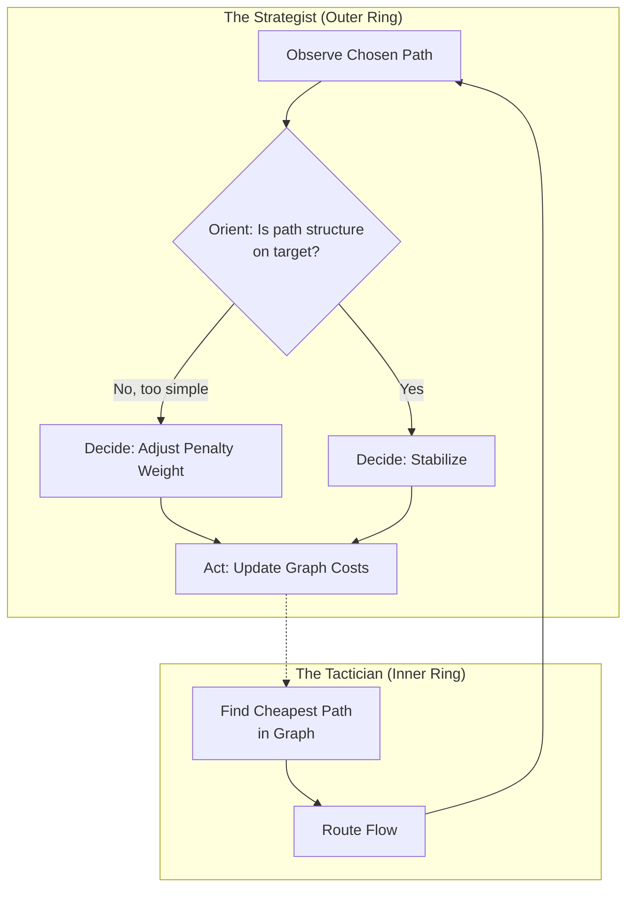

# MOMA Network Flow Manager

[](https://opensource.org/licenses/MIT)
[](https://www.google.com/search?q=https://github.com/neil-crago/moma_simulation_engine/actions/workflows/rust.yml)

An experimental simulation in Rust demonstrating a self-regulating system that manages network flow. This project showcases an agent that uses a **MOMA (Moving Origin Modular Arithmetic)** inspired architecture to achieve a high-level, abstract goal. Instead of simply maximizing flow, the agent dynamically adjusts its strategy to maintain a target level of "resilience" or "structural complexity" in its chosen paths, a property measured quantitatively using **Gowers Uniformity Norms**.

The system demonstrates a form of computational **homeostasis**, finding and maintaining a stable state that satisfies its strategic objectives.

-----

## Core Concepts

This project is built on a unique "Bungee-Rope-Chain" architecture that layers system components by their flexibility.

### The Bungee-Rope-Chain (BRC) Architecture

  * **The "Bungee" (The Strategist):** The most flexible layer. This is the main control loop. It observes the agent's actions, analyzes them using sophisticated tools (Gowers Norms), and sets the overall policy by deciding which behaviors should be encouraged or penalized.
  * **The "Rope" (The Tactician):** The workhorse layer. It executes the policy set by the Strategist. In this project, it's a Dijkstra-based pathfinding algorithm that finds the "cheapest" path through the network, where "cost" is dynamically defined by the Strategist.
  * **The "Chain" (The Foundation):** The rigid, unchanging rules of the simulation. This includes the graph data structures (`Node`, `Edge`), the fundamental MOMA calculations, and the laws of the Rust programming language itself.

### The Feedback Loop

The system operates on a continuous feedback loop, allowing it to "think" and adapt.



-----

## How It Works: The Agent's Journey

The simulation demonstrates the agent learning to satisfy its goal: **"Choose a path whose geometric complexity (Gowers Norm) is close to a target of `0.85`."**

1.  **Initial State:** The agent first chooses the most obvious, direct path. This path is short and efficient, but it's also very simple, with a high Gowers Norm (e.g., `0.8612`).
2.  **Self-Correction:** The Strategist sees that the norm is too high and penalizes this simple path by increasing its `cost`.
3.  **The "Aha\!" Moment:** After a few steps, the cost of the direct path becomes greater than the cost of a longer, more complex detour path. The agent makes a "smart" decision and switches to the detour.
4.  **Homeostasis:** The agent analyzes the new detour path and finds its Gowers Norm (e.g., `0.8384`) is now below the target. It has successfully achieved its goal. The Strategist's policy becomes **"STABILIZING,"** and it stops applying penalties. The agent remains on this new, stable path for the rest of the simulation.

-----

## Getting Started

### Prerequisites

  * You need the [Rust programming language and Cargo](https://www.rust-lang.org/tools/install) installed.
  * This project requires the `ordered-float` crate. Add the following to your `Cargo.toml` file:
    ```toml
    [dependencies]
    ordered-float = "4.2.0"
    ```

### Running the Simulation

1.  Clone the repository or save the project files.
2.  Navigate to the project directory in your terminal.
3.  Run the simulation with the release profile for best performance:
    ```bash
    cargo run --release
    ```

You will see the step-by-step log of the agent's decision-making process printed to the console.

-----

## Tuning the Agent's "Mind"

You can easily change the agent's behavior by adjusting the controller constants at the top of the `main.rs` file:

  * **`TARGET_GOWERS_NORM`**: The agent's goal. A lower value will force it to seek out more complex, winding paths.
  * **`COST_ADJUSTMENT_GAIN`**: How aggressively the agent reacts when it misses its target. Higher values lead to faster, more drastic policy changes.
  * **`COST_DECAY_RATE`**: The agent's "memory." A value close to `1.0` (like `0.99`) means penalties are "sticky" and last a long time. A lower value (like `0.90`) means the agent "forgets" penalties quickly.